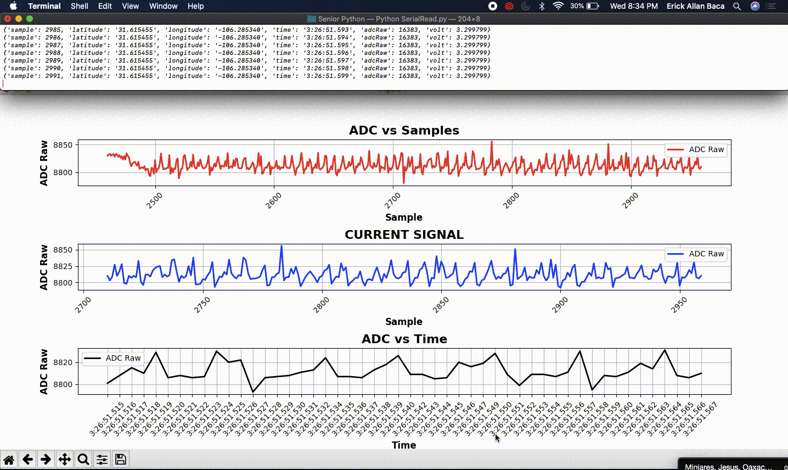

# **Intelligent Portable Infrasound Array (IPIA)** :zap:

## **Description**
This is the source code of our capstone project for Electrical and Computer Engineering department at `University of Texas at El Paso` *`(UTEP)`*. 

## **Team Members**
- [Erick A Baca](https://github.com/eabaca2419)
  - Hardware testing and system integration
- [Jesus Minjares](https://github.com/jminjares4)
  - Embedded software and firmware testing
- Cynthia Oaxaca
  - Power System
- Mariano Urbina
  - Hardware design  

## **Table of Contents**
* [Firmware](https://github.com/jminjares4/IPIA_FREERTOS/tree/main/Firmware)
  * drivers
  * inc
  * ipia.c
  * main_freertos.c
* [Hardware](https://github.com/jminjares4/IPIA_FREERTOS/tree/main/Hardware)
  * schematic1.0.sch
  * images
* [Media](https://github.com/jminjares4/IPIA_FREERTOS/tree/main/media)
  * gif
  * images
  * video
* Readme

## **Requirements**
- [x] Firmware running at real-time 
- [x] Read pressure sensor at 100hertz
- [x] Wireless communication between two MCUs 
- [x] Capture system location using a GPS
- [x] Time stamp capture data
- [x] Solar tracker to find optimal postion for the battery charger 

## **IPIA Data Capture**
To visualize the data that was being capture, a python script was develop that reads the data being transmitted via the wireless communication. 
The script uses `pyserial` and `matplotlib` packages to send the capture data from the `HC-05 Module` and store it into a csv file. Here is small demostration.

* [Jesus Minjares Python Script](https://github.com/jminjares4/Plotting-Sensor-Data)
## **Solar Tracker**

## **Software**

## **Microcontroller**
![Texas Instruments](https://img.shields.io/static/v1?label=&message=MSP432&color=696969&logoWidth=30&logo=data:image/png;base64,iVBORw0KGgoAAAANSUhEUgAAAGwAAAAoCAYAAAAbrx%2B3AAAKYklEQVR42u1aA5B0ORDOzpvV%2FDNr2zv4bfNs27Zt27Zt27Zt2%2Fbd99V2159Lvdm9mdNs1euqrnlJOnlJf0mnu9%2BYgAIK6P%2BkyuLixqVqyjdyuWNIwTATUO7RmLLorNvHpn53eanqyk3N4KQAsDpjqhuKi5tNQLkPWMyYqmtHJT6%2FZUzyx2QkMsoElJuAnZDovH9Caem8tcbUALDPCFgqEhnXXFjYWRWJNKBrMTjPBJQbgJE3aK7dtypi6ieXRmePi8UmNxUWdmnbHWNTv142svedGeWxRU1uUAAYwdijq%2FlcPm%2FeUn%2F4zLLYEq7MkjXlG5j%2FlwLA9upquWTj5rpDY%2FD6LxjR8zLrFqgqX3FUNDqD9VeOjH%2BkskvXlG9o%2Fj8KALsNpo53lDocLLOed5d0KbppTPI7ld%2BgsW4vE9A%2FT3EEwhcM73nF5ctG9L5rA3bOsO7njNCkkpL5WXf1qPhHKIZYN7YsOtOWv3h4zxtRuP3Gn4rAZQMz90ZALuWfN6z7BVF0Wsbp%2BeHSEb3vTy%2BLLbZWY82urDu0p%2B36UbHiSayHx%2FiF22evzuYLfV%2BY711UUBD%2B7S%2FwNxAvcboH1BUtSF0xIv7%2BQKCROwoLew7qab2az%2Bs31e25RkP1Dulk9%2B1svtTndWXhsHdlKBTawvO8NcCrA8BbAc7v4M%2B1Du0b4vdUzzOrBAj5EF1znJR3%2BgPr%2BtGJL3hArhRwp5bHFjlEwBN2nJTmi%2FzMoRunhcOhfQgYgHvFqh4ip6uJvw5rrOfW50vfAqfes19njZGWZIyo9CXnHtHj6w%2BwUxKdD9cXFbXi%2BTc6HdVDTN3VI%2BMfppPfqrXhaDMw%2BQKGk7U46r4D%2F%2Boy5F6FSCFO4S4o%2FyT176NO02RtKH8B%2FhZj74lyufWuvfvGCD0loDtzMXMw%2Fr2Q%2BQH8C%2Fjr%2FPzwC8yHmxykostHznU2bh2b%2FOWSEb1vESCWj4i33co1NWLy2PYV7MC01LbtDcc4YP12WrLzEToi2QJGolJZD2B2oK8DngyFzgtTeTJ%2Fpe8BYk5%2FQDFlgf0rfpdwTw2BFYB%2FxxiznfZR3AD5Ye82PA8FV4Mn4H2ng9c1uUjzVZQucxuAgvn7amQsNoV1K9VXbUkgLkTs5bcrj%2Bxtv0XBOry37QamqlyZLAF7gvV4nOrTLaJi6HeH9H%2BAjq%2FchSc68gRy%2BXA4%2FDbb%2BgDzLrPbsTF27KsPHenzvpZcdkKSbUVFbVZV3inJrgcJyBr1tTvRHIE9OiBrN9bucuuY1E83jU5%2Bt2h15RoK6D8JGBS9GIp1wuNwMtyTWw%2B59%2BSkfQET9iLvQOMQgQUou3EMkf0Zz61zAfVWZr3M5WGaXFSPHpS50VllZYvrKboZATIA%2BkbLAOznqRUlC6jsPw2YwwRwZZ9hZqipg6K39mlPidlsIAAY%2Bxk5TfvbJhOn7mr3fZB9jLkEM8gohOD5WT%2FnYtOWhoMo8G8BRjcfxeFkgLUIeCHjEEDayFLyZ64J87zQ0bwT0XdZMs0hZQsLwx87HmMeTzDl6WxIPChygyuQ5%2F22vA9gv7UUFXW4sv%2F2HebQaMh9D2BPgZKflbFut9zxqHiNn6L9Y2U9kei3pshVOOPmycn9RpyUWWaQUR6yG9e6OUY6AP8yYNN8uk3RQBz9Xobs0zKPBPp8pd6lnL4N4Gy8o3GaEgN4MXmPcG0oX0xP1D28HF%2FmkTKDjBjQlB4bb7%2FDBg1BT9xkT7zsT%2BpTXPhDFi1FvS5A3gs%2BT%2Fh88D18pvMDJV8iyhxvmcetxTT%2BCPO3INzIN2jifN67EuXk9MyPfpvz1NGtxyY6kDGb5YGeZXKEGnhHgNcg04P6K4diydqKdQ%2FtbbuR%2BURx%2F7OlEVDmKRLrgM0i4oKvKHW%2BDAXPB4XuoWWaLp0bFL%2B7JXsafyF7kGsJILfpXLnQMagahrqd%2BAyAbgPfDT4Xc1mO4iZXCBM8WXba15KOCSiHiTttVwImdn4QUgBYBczEqmQfD61T2xzzOR7jbMfcXZ%2BJNQtLfULkfVlSTtN82lYR971KxillYKvtmpoSClOe9WK%2BelROTKUvMYUlfZah08FMSD%2FzHA0u4hzsPvbVorKS8hozwLqHWX2T0N2W0N1e%2BF1f1h3NADBOPnS8fXFLvaaC7pLkaQxcgPKFjFfoUrON6R9xBHpRPoNj0KGg6y1j%2FoLyB5JYfZ4ZDD6zDYO%2FBUfiDoz%2FqLjd32N%2Bm6m3J%2F0%2FJ5CO8peSoHppKhbvfUgzH2kSt1M5Z7JuPMZn7KP9wO%2FLPH%2BAI3K7yCyjMnRMbDWifJhkT7rlk9G30v9n6fOTlL%2FFeDdRz%2BhzKNdJx6hPr%2BGXOCeAvkBGJpFK0onJh8SJ1p13Kr01vbjFhd5c22W3LsndzkyC7hYuUHJ41%2BprQFsx0aoeIfqsYIT4bKWQ6sCTWRYX3qV63STiAZ5mKXYfNzzB%2B%2B6zksae7nSp%2B82JyQr5%2FU4%2BDXVZepGsijXf%2FPAnXC8tjYYR1FXf2kLHqkVA%2B360RKoPx6kZSQ82G8A%2BA39pRfoJFzA9iZJI9QmgxWxYmXXGP66MBdiyVn0V6wSIOM2nAPZUJoBxDXrK3JOUHjDbJLFdSADjiRDZX2mONbmc3wdYnrARwM72SSrnafjBOI9xpZuzzBgwmjg8TucJ00mi3PRnwIzEMmAxi5jYwW6QOQBgxgJsLfmsMQZyV8iCbuaUMgVMYqhvnVNWSAWBH%2BwPMKx%2FY4yxDn7XwzyuYT8bMN5pWOtz9rXhAGYGAIw0UbMtZCQy32W2hjrPHjAQYx7eJWqOsIDLFTDZKTuJzf%2Fd4l9Qv32mgNnMU80NoaYlC8DOo0m27zIJjn%2BmY5AWMLlLuUH5K1eCC1gTmdkZDYl4h2UIGOe5Bu9Kd%2B0CXChjwJwvwD%2FpgAKYTRF6N5jUEXQw1FxwgZkAJpn4UsgebmXKy7MFjH1R%2F4ncIUdzEzDuRH1NBiZxNDjsAxipXUAVvWQGmIow4Yz2fakHO%2FuSNWCafeDJsQALpzm%2BdWqKaCoyBEzvsALWOZtjtOz%2BN33emVBFOoBxLds6DlRjZoAJ%2BQNGivOUZAqYuP8uRXTddOjSAbabD2Cb00b7HOG1eXJUiXRfeXk6C0xSETSjVE6WgBnGJKwTN3cOzZIqRtJoedYiL7C9R6abBDBSsZ4C5gelbiDAajgFYbanuIktwJrBNg3nSU4D2DkuYOKwHUWLhMdaZ7O%2FL3OYaPwQhQJv0MtTvDFP4qev%2FTw%2FIm%2Ft3o3l4vyOpopKE9P5HmMje968%2B2QXvujERm2Wc3CgZbs9AmE5POPAUxnn6UmTeO0L3iVWMBpjpl9ivCrdaIyB8FjiJH5%2F4053Ngj5O44rrJ9X5kBmQz6LZ%2BjSeP5ByAFsCOcoluIO55vaMLFYP3OukHtc3vs53rOJSUPt%2FASvjPJYcJlVHpXONGgGQmKkFG2uZDhGEyDXTDrvGWm1jXXaIk5YMEKi%2FxapK5Ls%2Bma0BHSKaELtDaBjKYiO%2BfbQtqjKyF2Rx3dInR8vypNq9ZlvAL0odThri%2Fv8V6Qb480jie8JfI%2F5DymggAL6A7%2FPpMSyS0OKAAAAAElFTkSuQmCC)

## **Software Development**
![Texas Instruments](https://img.shields.io/static/v1?label=Software&message=Code%20Composer%20Studio&color=red&logoWidth=30&logo=data:image/png;base64,iVBORw0KGgoAAAANSUhEUgAAAGwAAAAoCAYAAAAbrx%2B3AAAKYklEQVR42u1aA5B0ORDOzpvV%2FDNr2zv4bfNs27Zt27Zt27Zt2%2Fbd99V2159Lvdm9mdNs1euqrnlJOnlJf0mnu9%2BYgAIK6P%2BkyuLixqVqyjdyuWNIwTATUO7RmLLorNvHpn53eanqyk3N4KQAsDpjqhuKi5tNQLkPWMyYqmtHJT6%2FZUzyx2QkMsoElJuAnZDovH9Caem8tcbUALDPCFgqEhnXXFjYWRWJNKBrMTjPBJQbgJE3aK7dtypi6ieXRmePi8UmNxUWdmnbHWNTv142svedGeWxRU1uUAAYwdijq%2FlcPm%2FeUn%2F4zLLYEq7MkjXlG5j%2FlwLA9upquWTj5rpDY%2FD6LxjR8zLrFqgqX3FUNDqD9VeOjH%2BkskvXlG9o%2Fj8KALsNpo53lDocLLOed5d0KbppTPI7ld%2BgsW4vE9A%2FT3EEwhcM73nF5ctG9L5rA3bOsO7njNCkkpL5WXf1qPhHKIZYN7YsOtOWv3h4zxtRuP3Gn4rAZQMz90ZALuWfN6z7BVF0Wsbp%2BeHSEb3vTy%2BLLbZWY82urDu0p%2B36UbHiSayHx%2FiF22evzuYLfV%2BY711UUBD%2B7S%2FwNxAvcboH1BUtSF0xIv7%2BQKCROwoLew7qab2az%2Bs31e25RkP1Dulk9%2B1svtTndWXhsHdlKBTawvO8NcCrA8BbAc7v4M%2B1Du0b4vdUzzOrBAj5EF1znJR3%2BgPr%2BtGJL3hArhRwp5bHFjlEwBN2nJTmi%2FzMoRunhcOhfQgYgHvFqh4ip6uJvw5rrOfW50vfAqfes19njZGWZIyo9CXnHtHj6w%2BwUxKdD9cXFbXi%2BTc6HdVDTN3VI%2BMfppPfqrXhaDMw%2BQKGk7U46r4D%2F%2Boy5F6FSCFO4S4o%2FyT176NO02RtKH8B%2FhZj74lyufWuvfvGCD0loDtzMXMw%2Fr2Q%2BQH8C%2Fjr%2FPzwC8yHmxykostHznU2bh2b%2FOWSEb1vESCWj4i33co1NWLy2PYV7MC01LbtDcc4YP12WrLzEToi2QJGolJZD2B2oK8DngyFzgtTeTJ%2Fpe8BYk5%2FQDFlgf0rfpdwTw2BFYB%2FxxiznfZR3AD5Ye82PA8FV4Mn4H2ng9c1uUjzVZQucxuAgvn7amQsNoV1K9VXbUkgLkTs5bcrj%2Bxtv0XBOry37QamqlyZLAF7gvV4nOrTLaJi6HeH9H%2BAjq%2FchSc68gRy%2BXA4%2FDbb%2BgDzLrPbsTF27KsPHenzvpZcdkKSbUVFbVZV3inJrgcJyBr1tTvRHIE9OiBrN9bucuuY1E83jU5%2Bt2h15RoK6D8JGBS9GIp1wuNwMtyTWw%2B59%2BSkfQET9iLvQOMQgQUou3EMkf0Zz61zAfVWZr3M5WGaXFSPHpS50VllZYvrKboZATIA%2BkbLAOznqRUlC6jsPw2YwwRwZZ9hZqipg6K39mlPidlsIAAY%2Bxk5TfvbJhOn7mr3fZB9jLkEM8gohOD5WT%2FnYtOWhoMo8G8BRjcfxeFkgLUIeCHjEEDayFLyZ64J87zQ0bwT0XdZMs0hZQsLwx87HmMeTzDl6WxIPChygyuQ5%2F22vA9gv7UUFXW4sv%2F2HebQaMh9D2BPgZKflbFut9zxqHiNn6L9Y2U9kei3pshVOOPmycn9RpyUWWaQUR6yG9e6OUY6AP8yYNN8uk3RQBz9Xobs0zKPBPp8pd6lnL4N4Gy8o3GaEgN4MXmPcG0oX0xP1D28HF%2FmkTKDjBjQlB4bb7%2FDBg1BT9xkT7zsT%2BpTXPhDFi1FvS5A3gs%2BT%2Fh88D18pvMDJV8iyhxvmcetxTT%2BCPO3INzIN2jifN67EuXk9MyPfpvz1NGtxyY6kDGb5YGeZXKEGnhHgNcg04P6K4diydqKdQ%2FtbbuR%2BURx%2F7OlEVDmKRLrgM0i4oKvKHW%2BDAXPB4XuoWWaLp0bFL%2B7JXsafyF7kGsJILfpXLnQMagahrqd%2BAyAbgPfDT4Xc1mO4iZXCBM8WXba15KOCSiHiTttVwImdn4QUgBYBczEqmQfD61T2xzzOR7jbMfcXZ%2BJNQtLfULkfVlSTtN82lYR971KxillYKvtmpoSClOe9WK%2BelROTKUvMYUlfZah08FMSD%2FzHA0u4hzsPvbVorKS8hozwLqHWX2T0N2W0N1e%2BF1f1h3NADBOPnS8fXFLvaaC7pLkaQxcgPKFjFfoUrON6R9xBHpRPoNj0KGg6y1j%2FoLyB5JYfZ4ZDD6zDYO%2FBUfiDoz%2FqLjd32N%2Bm6m3J%2F0%2FJ5CO8peSoHppKhbvfUgzH2kSt1M5Z7JuPMZn7KP9wO%2FLPH%2BAI3K7yCyjMnRMbDWifJhkT7rlk9G30v9n6fOTlL%2FFeDdRz%2BhzKNdJx6hPr%2BGXOCeAvkBGJpFK0onJh8SJ1p13Kr01vbjFhd5c22W3LsndzkyC7hYuUHJ41%2BprQFsx0aoeIfqsYIT4bKWQ6sCTWRYX3qV63STiAZ5mKXYfNzzB%2B%2B6zksae7nSp%2B82JyQr5%2FU4%2BDXVZepGsijXf%2FPAnXC8tjYYR1FXf2kLHqkVA%2B360RKoPx6kZSQ82G8A%2BA39pRfoJFzA9iZJI9QmgxWxYmXXGP66MBdiyVn0V6wSIOM2nAPZUJoBxDXrK3JOUHjDbJLFdSADjiRDZX2mONbmc3wdYnrARwM72SSrnafjBOI9xpZuzzBgwmjg8TucJ00mi3PRnwIzEMmAxi5jYwW6QOQBgxgJsLfmsMQZyV8iCbuaUMgVMYqhvnVNWSAWBH%2BwPMKx%2FY4yxDn7XwzyuYT8bMN5pWOtz9rXhAGYGAIw0UbMtZCQy32W2hjrPHjAQYx7eJWqOsIDLFTDZKTuJzf%2Fd4l9Qv32mgNnMU80NoaYlC8DOo0m27zIJjn%2BmY5AWMLlLuUH5K1eCC1gTmdkZDYl4h2UIGOe5Bu9Kd%2B0CXChjwJwvwD%2FpgAKYTRF6N5jUEXQw1FxwgZkAJpn4UsgebmXKy7MFjH1R%2F4ncIUdzEzDuRH1NBiZxNDjsAxipXUAVvWQGmIow4Yz2fakHO%2FuSNWCafeDJsQALpzm%2BdWqKaCoyBEzvsALWOZtjtOz%2BN33emVBFOoBxLds6DlRjZoAJ%2BQNGivOUZAqYuP8uRXTddOjSAbabD2Cb00b7HOG1eXJUiXRfeXk6C0xSETSjVE6WgBnGJKwTN3cOzZIqRtJoedYiL7C9R6abBDBSsZ4C5gelbiDAajgFYbanuIktwJrBNg3nSU4D2DkuYOKwHUWLhMdaZ7O%2FL3OYaPwQhQJv0MtTvDFP4qev%2FTw%2FIm%2Ft3o3l4vyOpopKE9P5HmMje968%2B2QXvujERm2Wc3CgZbs9AmE5POPAUxnn6UmTeO0L3iVWMBpjpl9ivCrdaIyB8FjiJH5%2F4053Ngj5O44rrJ9X5kBmQz6LZ%2BjSeP5ByAFsCOcoluIO55vaMLFYP3OukHtc3vs53rOJSUPt%2FASvjPJYcJlVHpXONGgGQmKkFG2uZDhGEyDXTDrvGWm1jXXaIk5YMEKi%2FxapK5Ls%2Bma0BHSKaELtDaBjKYiO%2BfbQtqjKyF2Rx3dInR8vypNq9ZlvAL0odThri%2Fv8V6Qb480jie8JfI%2F5DymggAL6A7%2FPpMSyS0OKAAAAAElFTkSuQmCC)

## **Electronic Design Automation**
![EagleCAD](https://img.shields.io/static/v1?label=&message=EagleCAD&color=E3D8CD&logo=data:image/png;base64,iVBORw0KGgoAAAANSUhEUgAAADEAAAAxCAYAAABznEEcAAAAAXNSR0IArs4c6QAACUdJREFUaEPtWX1sVtUZ%2F52P%2B75vW6At31hMgbasAxS1DIMTkLEghk0Ss8WvmLGFZUsW56a4qRvsw5DsDzKSZXER4zY0m9PuIxFmRAvWAYM6aKG10oI2tJShFKl2bWnfe%2B95luec21q3xPaUjxDiTd68995z7rnP73l%2Bz3k%2BrsAVcIgrAAM%2BBXG5WNHbEo%2FdUTGtK8zmTxkbbJwyRsyRQkzNz5EFeQFBCgEtHTQlCBASqRQhoBjSROjopf%2B0nJV7PuiLHvnRc2%2FWXygleIHY%2BbNl1HHyBCiMEGZD6DH5qFhUgcZDDXj%2F5Cnk5qYtEKUUlIgRBBopCUjJ4PhHkIgRSEArCZ2ThyB3HHIKx%2BMHr76oKysRjwaYF4ita2ZTYR6ht7sXRISY3OPGRCDSIBhksyFKrpmHWTOLcPj1amgloISCVgSlgICFF4AQAilFCIIUVEpDp9MQOoOyh%2Fd5ycTv93rg6XuKyUQRCvIAYgBEFoyxQARi4jM3xjoPTcwDgE7j9jtWoK5qB9IpibRi6jEwQAsByf%2FWYhKZlMKM9c1ecnlNfuruq4mFGlcwDqmwGzE54xtjHBghYCBAxoEjkogZl4gQG%2BmsFxuUziunTFer0CIBJAElhf0JKVH%2B82NecnlN%2Fu1dVxHLzcotzBNIaZEICyssa9%2BQsSBYdqabA8MgJQx4zIFx82Lc%2BtXVOHvgFSgdWGuwv5Q93uIll9fkrfdMo4icENmYUDxeJ5ZIaEXS8jNkQAnVBulmBR8AxRZjEO46NgI3LlkAdarRWmND8w26srJyxE7uB%2BLeIrJ8F8KaY%2BJYgmZvJSQ0Yo3bS%2Bsjhu%2Fztd0EHPeYbkyp5BKGwRknRmQMFs5MY1vLmNXrKxtfHOlO5QXi2fuKyLAlmPMAppeVQXS8M7gvOq0OWIHBCBh2HMFOz9ZKND9kQ%2BB7zqcYNFsIKJ2a07l089vjLwqIP95XxGErEc7AmBAzJqUthVibFoTdnVjgj6zgzt09Oz7oF04ZrJSIV7FWA9LI4s4%2FdIxYwSOeyFp57mtFxNplDtutFAKlMyYg7jqbUId57%2FwCJgSpFI52it8QqX4tkTEmRhhGORAyHcWxFFIrAxOK2PRFqdyTO46GW6oOtrSN1AID87xAPL9mOhm2RKIx1u6CJZ9H51v77XbLGuUjNITlv27zWttX8KHzvV70569fbS0RJc7KPO7v78Pc6XkJMAdi0ebjXuueDwDviP3Xb0wnIxQ4EMdw26oQBmWTUm7nYR82ET73yxOXL4i%2FrS22iYWjE7l9HkDZBEAoDmaOUgs2XcaW2P7NIopFKnFit9cbQygtCKEzOWwbwEhUncq%2F66Fnap8%2FX5qM9Hkvs2%2F71iyykdbu90wfB2TBdbPQfarVphdu15Loj0T01K6C3C0HD4YjFWa087xAvPTtWezXVvvsExwbBBFuXnkLOg7tdgCSAOF8xlVIfC5sUIuRkoQsNDq6TUsW%2Br3T51JNu1vMM7%2Bvbqq%2BJCB2fKeUXNByeZC1BAgrbl%2BJEzVVNqA5IAmYxNntfR4SnChKmLAflDcBYWYMorAfSqfx9%2Frer2x8oe4vowHiZYlX7y8hzmC57ORUwabi1hJfxJnaXYnWk0BoiedQcA1SOO9mvHHwTWQCtwlwBsx5l1ICgZaobw8fXPtE7eaLDmLnd0vJWcFpO4ltqFj4WXS1NH3s%2FZxGTL1%2BCV7eVgWdl4eAKzwloLWy51yyKq7ytLSlak1rdu39T9Y9fdFBVH%2BvjOIk%2BWO%2FsLkQScyeqoAoGny%2FLpyMfUc6oLSCVDIBwJWbQkopCOWKIAYkud7WCgsf3e%2FFilFH7Ne%2FP9v6hAWQ5E7Mr%2BKxWaggbe9k5i3Hntf%2B4TQNQLL2FYOB07yQUNqdczkaBBLpIJW97uHdvMCoDi%2F0ux%2F6zCCdLJU4hQZQXMC5qcLEG2%2FDKy9VuY4HNwMk00ZBSWOtwgAcGL7PYNL48FxUf9vGmvmjkj55yAvEnnXlJMg59IA%2FZLMRZk5UMFEfGrrGQvF2KhVX2tYaQnHZGSdgnC%2BkA4H9x%2BWaB3%2F3xtbzEX7gWS8Qe9fNIc6VmE5MHf7jUnTmuAinC%2BbivbYWCN5HBbC9Ibp2S1VTw4UQcrg1vED8c91cgnABmINzDIE5i5eh40AVjnVr6CBlY8iqTQ1e6w4n5HDjXi9jS2gVD9bNvHjhxELEH55Ge5xvrcOl6MpfHPJadzghhxv3elnND8sJxEkEl6iu6B8jzoELvbNyvKUR%2B8IXNl7GIOoe4bRDgiMCJ1F9%2FVnkau7mSXTKXKQzaRgjccvj%2F%2FJSznCaHm7c62WHHy0j2xBLcqKr5i9E24G9NnzPW3YrDtfVMpvQ3iX%2FdOemmruHe%2FmFGvcC0fhYCUXc1056St09vXbrtIcAgkmT7f7Pi57LijNLf7p%2F0oUS9JPW8QPx4zKbpkYGCLP96OrjVJtLVNu0wZTZc9Hd%2FQGk9Q1OKThmcLoB8Ewb%2FIRAXxadsZBtnIL19FGvAnryx6rJPGYImWsf2FXuA94LRPNPyshEBrGQmFB%2BPQ7v3ZcAcK%2B07chVX0b70Tp7zYGNt1wWjhvFNhWxbX3Ye5KzWBvVXaufx2UUY8ranV5yeU1u3lBC0tqC0Pxu1u1G1goJo3hMEhZ%2FaTVa36m3FhngGn9kGRCen2FQioElrf0BIO31R1Cxya%2Fd4wXi7Q0zCNAgrdHY2mM7HYxEKAWKIyuQgwjcsGw5es602CzWajkZsxbh3Iq1wbkUg7GZooQig2O1zd4tHy8Qx9YXkxAB6tqzrr%2FPEAYtwUIxAta47fMjzvajYukiaJxLaMUpOE9x1LKWSf55Lf5M1ri%2FEUt%2B1eoll9fk5vUlpCnmAmbwGxMvMACE6%2B2PA0vIpBUWL70GcRgOOrqlFH%2BcHPKxShqgtqYJK564yCDaezM4%2Be7ZhOu8M7m2po3fTJuhX9BY1TYT4XlASDFuWnwT8oNu%2B33LNhWG%2BFR3RxeONJ%2FAqifbvZTrNbllfTG9drTf%2BcFQh%2BZzwTWFzWGTsDFw5gD878FFEWNYuGg%2BCsc532pqaMOzjVS8ZftbXk1lLxAvPzCXjv%2F7fadBpSEMN%2FrdYbiGIOZ40tmwHu78xFmI%2FZi%2FDhkbIMlEyNNAfc%2F4F%2FZ0Tru3urr6o%2Fr2%2FzF%2F4h0vEJ5rX7Lpn4K4ZKoe5kVXhCX%2BC1G0f24AESeRAAAAAElFTkSuQmCC)

## **Acknowledgements**
- **Dr. Hector Erives** :zap:
  - Senior project I & II Sponsor
- ECE Department (UTEP) :zap:

## **Authors**
- [Jesus Minjares](https://github.com/jminjares4)
  - Bachelor of Science in Electrical Engineering

### **License**

### *Latest Version*

